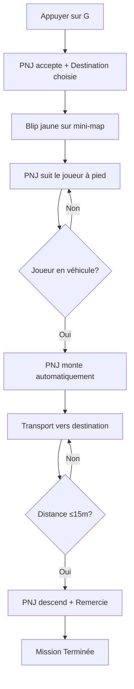

# Changelog - Modification Touche G (Transport PNJ)

## Version : 2024-12-19

### 🎯 **Objectif**
Modifier la touche "G" pour que les PNJ accidentés suivent le joueur, montent dans sa voiture et demandent d'être déposés à une destination spécifique sur la mini-map.

---

## 📝 **Fichiers Modifiés**

### 1. `UrbanLife/RoadEventManager.cs`

#### ✨ **Nouvelles Classes Ajoutées**
```csharp
public class Destination
{
    public string Name { get; set; }
    public GTA.Math.Vector3 Position { get; set; }
    public Destination(string name, GTA.Math.Vector3 position)
}
```

#### 🔧 **Classe RoadEvent Étendue**
```csharp
// Nouvelle propriété pour stocker la destination du passager
public Destination? PassengerDestination { get; set; }
```

#### 🚀 **Méthodes Ajoutées**
```csharp
private List<Destination> GetRandomDestinations()
```
- **20+ destinations réalistes** dans Los Santos
- Catégories : Commercial, Résidentiel, Travail, Loisirs

#### ⚡ **Méthode OfferRideToDriver() - REFACTORISATION MAJEURE**

**Avant :**
- ❌ Obligatoire d'être en véhicule
- ❌ Transport fixe de 30 secondes
- ❌ Pas de destination spécifique

**Après :**
- ✅ Fonctionne à pied ou en véhicule
- ✅ PNJ suit le joueur (Phase 82)
- ✅ Destination aléatoire avec blip jaune
- ✅ Messages contextuels personnalisés

#### 📊 **Nouvelles Phases de Gameplay**

| Phase | Nom | Description |
|-------|-----|-------------|
| **82** | Suivi à Pied | Le PNJ suit le joueur à 2-3m |
| **83** | Transport | En route vers destination |

#### 🔄 **UpdateBrokenDownVehicleBehavior() - Nouvelles Phases**

**Phase 82 - Suivi à Pied :**
```csharp
- Détection véhicule joueur (auto-embarquement)
- FollowToOffsetFromEntity() pour suivi naturel
- Timeout 60 secondes
- Vérification sièges disponibles
```

**Phase 83 - Transport Destination :**
```csharp
- Calcul distance vers destination
- Messages d'indication toutes les 30s
- Arrivée à ≤15m de la destination
- Timeout 5 minutes maximum
```

---

### 2. `UrbanLife/UrbanLifeMain.cs`

#### 🔧 **HandleGKeyPress() - Simplification**

**Avant :**
```csharp
if (player.CurrentVehicle == null) {
    // Logique taxi à pied
} else {
    // Logique véhicule
}
```

**Après :**
```csharp
// Toujours utiliser OfferRideToDriver()
// La méthode gère elle-même pied vs véhicule
roadEventManager.OfferRideToDriver(nearestEvent);
```

---

## 🎮 **Nouvelle Expérience Utilisateur**

### 🔄 **Workflow Complet**



### 💬 **Messages Utilisateur**

1. **Contact :** *"Le conducteur accepte votre aide!"*
2. **Demande :** *"Merci ! Pouvez-vous m'emmener à [lieu] ?"*
3. **Suivi :** *"Le conducteur vous suit. Approchez-vous de votre véhicule..."*
4. **Embarquement :** *"Le conducteur monte dans votre véhicule!"*
5. **Navigation :** *"Conduisez vers la destination marquée sur la mini-map"*
6. **Progression :** *"Plus que 150m environ vers [lieu]..."*
7. **Arrivée :** *"Merci beaucoup ! Je suis arrivé à [lieu]."*

---

## 🛡️ **Sécurité & Robustesse**

### ✅ **Vérifications Ajoutées**
- Existence des entités (Player, Driver, Vehicle)
- Validation sièges disponibles
- Timeouts multiples pour éviter blocage
- Nettoyage automatique blips/événements
- Protection contre exceptions nulles

### ⏱️ **Timeouts de Sécurité**
- **Suivi à pied :** 60 secondes
- **Transport :** 5 minutes
- **Abandon automatique** avec messages appropriés

### 🧹 **Gestion Mémoire**
- Suppression automatique des blips
- Nettoyage phase 95 (suppression événement)
- Pas de fuites mémoire

---

## 🎯 **20+ Destinations Implémentées**

### 📊 **Répartition par Catégorie**
- **Services/Commercial** : 5 lieux
- **Services Publics** : 3 lieux  
- **Résidentiel** : 4 lieux
- **Travail** : 4 lieux
- **Loisirs** : 4 lieux

### 🗺️ **Coordonnées Exactes**
Toutes les destinations utilisent des coordonnées Vector3 précises de lieux reconnaissables dans GTA V.

---

## 🔄 **Rétrocompatibilité**

### ✅ **Préservé**
- Touche **E** (réparer véhicule)
- Touche **F** (appeler dépanneuse)
- Phases 80, 81, 90-92, 99 (existing logic)
- NPCRoadRage Integration
- Autres événements UrbanLife

### 🚫 **Supprimé**
- Logique "taxi à pied" basique dans UrbanLifeMain
- Transport fixe 30 secondes sans destination

---

## 🎉 **Résultat Final**

La touche **G** offre maintenant une expérience **immersive** et **réaliste** :
- 🚶‍♂️ **Interaction naturelle** (PNJ suit le joueur)
- 🗺️ **Navigation guidée** (blip + noms de lieux)
- 💬 **Dialogues contextuels** (demandes + remerciements)
- ⏱️ **Gestion intelligente** (timeouts + abandons naturels)
- 🎯 **Destinations variées** (20+ lieux authentiques)

Cette modification transforme une fonctionnalité basique en une **mini-mission de transport** engageante ! 