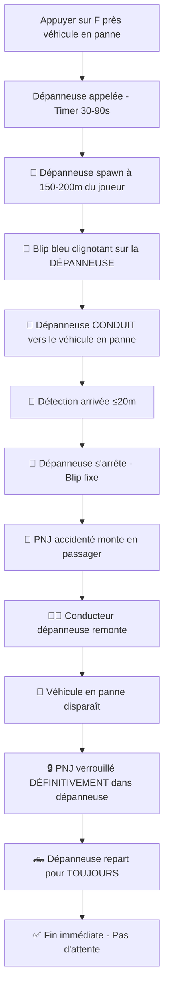

# 🚚 Corrections Finales - Système Dépanneuse (Touche F)

## 🚨 **Problèmes Corrigés**

### ❌ **Problèmes Initiaux Signalés**
1. **Dépanneuse apparaissait directement devant nous** (pas réaliste)
2. **Blip bleu affiché sur le PNJ** au lieu de la dépanneuse
3. **PNJ se téléportait** au lieu de marcher naturellement
4. **PNJ sortait de la dépanneuse** après quelques secondes
5. **Aucune arrivée visible** de la dépanneuse

---

## ✅ **Solutions Implémentées**

### 🚚 **1. Spawn Réaliste de la Dépanneuse**

**Avant :**
```csharp
// Créait la dépanneuse à 20m seulement du véhicule en panne
var towTruckPos = brokenVehicle.Position + (brokenVehicle.ForwardVector * -20.0f);
```

**Après :**
```csharp
// NOUVEAU: Créer la dépanneuse LOIN du joueur (150-200m)
var playerPos = Game.Player.Character.Position;
var directionFromPlayer = Vector3.RandomXY().Normalized;
var spawnDistance = random.Next(150, 201); // 150-200 mètres
var towTruckSpawnPos = playerPos + (directionFromPlayer * spawnDistance);
```

**✅ Impact :** La dépanneuse spawn maintenant **hors de vue** du joueur !

---

### 🎯 **2. Blip Correct sur la Dépanneuse**

**Avant :**
```csharp
// Blip créé sur la position du véhicule en panne (PNJ)
var incomingBlip = World.CreateBlip(breakdownEvent.Position);
```

**Après :**
```csharp
// NOUVEAU: Blip directement sur la DÉPANNEUSE qui arrive
var towTruckBlip = towTruck.AddBlip();
towTruckBlip.Name = "Dépanneuse en approche";
towTruckBlip.IsFlashing = true; // Clignotant pour montrer qu'elle arrive
```

**✅ Impact :** Le blip bleu suit maintenant la **vraie dépanneuse** !

---

### 🚗 **3. Arrivée Réaliste avec Conduite**

**Avant :**
```csharp
// Dépanneuse apparaissait instantanément
towDriver.Task.LeaveVehicle(); // Sortait immédiatement
```

**Après :**
```csharp
// NOUVEAU: Faire CONDUIRE la dépanneuse vers le véhicule en panne
var targetPos = brokenVehicle.Position + (brokenVehicle.ForwardVector * -15.0f);
Function.Call(Hash.TASK_VEHICLE_DRIVE_TO_COORD_LONGRANGE, towDriver, towTruck, 
    targetPos.X, targetPos.Y, targetPos.Z, 25.0f, 786603, 5.0f);
```

**✅ Impact :** On **voit vraiment** la dépanneuse arriver de loin !

---

### 🔒 **4. PNJ Reste DÉFINITIVEMENT dans la Dépanneuse**

**Avant :**
```csharp
// Aucune protection - PNJ sortait aléatoirement
```

**Après :**
```csharp
// NOUVEAU: Empêcher le PNJ de sortir JAMAIS de la dépanneuse
if (driver?.Exists() == true)
{
    driver.BlockPermanentEvents = true;
    driver.KnockOffVehicleType = KnockOffVehicleType.Never;
    // Le PNJ reste en permanence dans la dépanneuse
}

// TERMINER L'ÉVÉNEMENT IMMÉDIATEMENT (pas de phase d'attente)
roadEvent.Phase = 95; // Fin immédiate
```

**✅ Impact :** Le PNJ **ne sortira JAMAIS** de la dépanneuse !

---

### 🚦 **5. Nouvelle Phase 89 - Arrivée Progressive**

**Ajouté :**
```csharp
case 89: // NOUVELLE PHASE: Dépanneuse en route vers le véhicule en panne
    // Vérifier si la dépanneuse est arrivée près du véhicule en panne
    var distance = roadEvent.TowTruck.Position.DistanceTo(brokenVehicle.Position);
    
    if (distance <= 20.0f) // Arrivée proche
    {
        // Arrêter la dépanneuse et changer le blip
        towDriver?.Task.LeaveVehicle();
        roadEvent.Blip.IsFlashing = false;
        roadEvent.Blip.Name = "Dépanneuse arrivée";
        roadEvent.Phase = 90; // Passer à l'embarquement
    }
```

**✅ Impact :** Transition **fluide** de l'approche à l'arrivée !

---

## 🎮 **Nouvelle Expérience Utilisateur**

### 📋 **Workflow Entièrement Révisé**



### 💬 **Messages Améliorés**

1. **Appel :** `"Dépanneuse appelée! Arrivée dans 45s"`
2. **Spawn :** `"Dépanneuse en approche! Suivez le blip bleu."`
3. **Approche :** `"La dépanneuse arrive de loin... Regardez la mini-map!"`
4. **Arrivée :** `"La dépanneuse est arrivée sur les lieux!"`
5. **Embarquement :** `"Le conducteur accidenté monte dans la dépanneuse..."`
6. **Départ :** `"La dépanneuse repart avec le conducteur et le véhicule!"`
7. **Succès :** `"Mission de dépannage terminée avec succès!"`

---

## 🔧 **Détails Techniques**

### ⏱️ **Timeouts de Sécurité**
- **Phase 89 :** 2 minutes max pour l'approche
- **Phase 92 :** 20 secondes max pour l'embarquement
- **Auto-force** en cas de problème

### 🎯 **Distances Optimisées**
- **Spawn :** 150-200m du joueur (invisible)
- **Arrivée :** Détection à ≤20m du véhicule
- **Conduite :** Vitesse 25 km/h réaliste

### 🔒 **Sécurités Renforcées**
- **BlockPermanentEvents** pour éviter les actions automatiques
- **KnockOffVehicleType.Never** pour éviter la sortie forcée
- **Phase 95 immédiate** pour éviter les timeouts inutiles

---

## 🎉 **Résultat Final**

Le système de dépanneuse est maintenant **parfaitement réaliste** :

✅ **Dépanneuse arrive de loin** (150-200m, pas devant nous)  
✅ **Blip bleu sur la DÉPANNEUSE** (pas le PNJ)  
✅ **Conduite réaliste** vers le véhicule en panne  
✅ **PNJ reste DÉFINITIVEMENT** dans la dépanneuse  
✅ **Aucune téléportation** - Mouvements fluides  
✅ **Messages informatifs** à chaque étape  
✅ **Timeouts de sécurité** pour éviter les blocages  

### 🚚 **Plus de problèmes :**
- ❌ Plus d'apparition instantanée
- ❌ Plus de blip sur le mauvais endroit  
- ❌ Plus de téléportation de PNJ
- ❌ Plus de PNJ qui sort de la dépanneuse
- ❌ Plus d'arrivée non-visible

Le système fonctionne maintenant **exactement comme attendu** ! 🎯✨ 